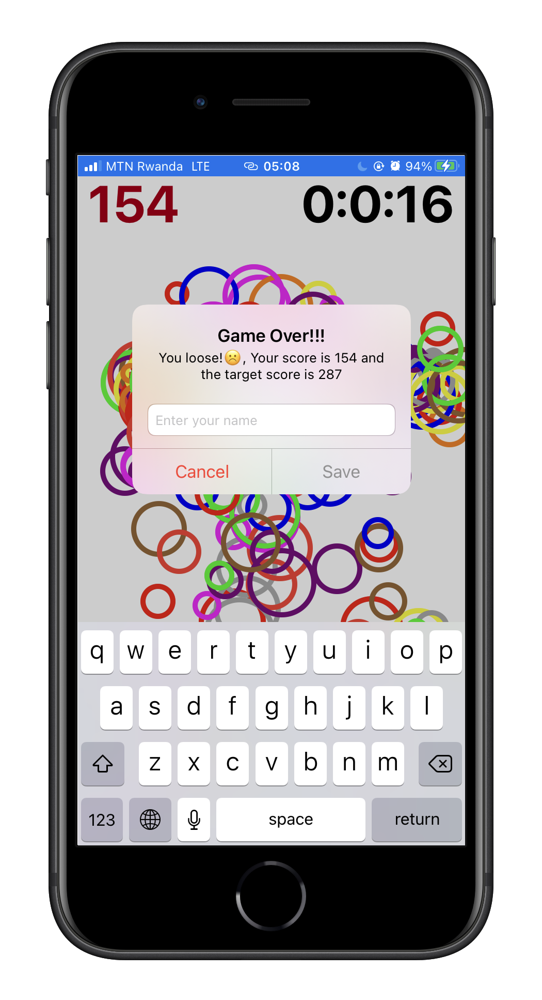

# CIRCLES


A UIKit game builit using `UserDefaults` (to store game players/winners and) and view `touches events 

```swift
touchesBegan(_ touches: Set<UITouch>, with event: UIEvent?)
```


&nbsp;&nbsp;&nbsp;&nbsp;

